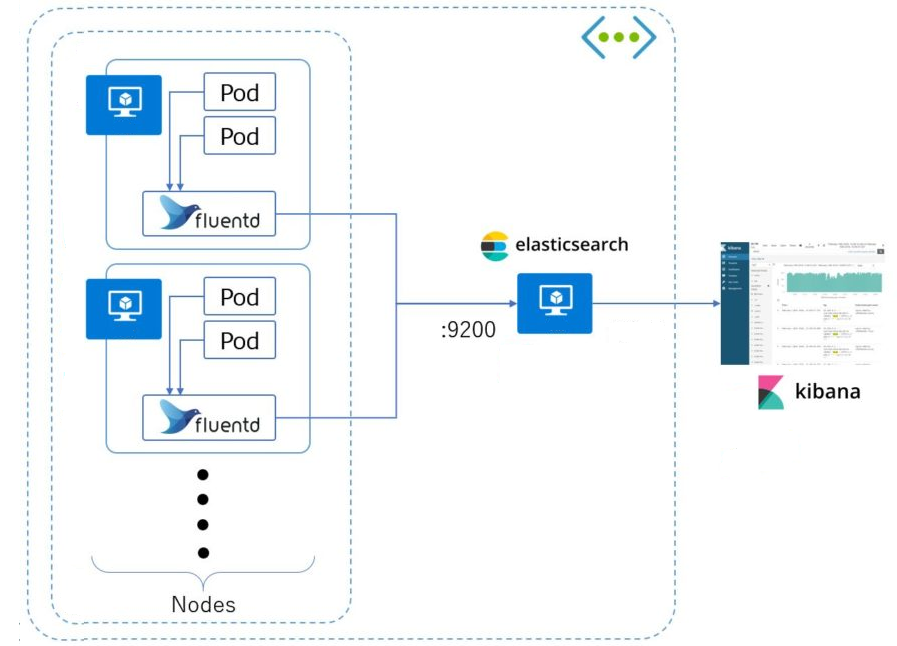

# iCommerce
An online shopping application which sell the products.

### Technologies
- [x] **Container Orchestration Engine**: [Kubernetes](https://kubernetes.io/) - [Docker](https://www.docker.com/)
- [x] **The package manager for Kubernetes**: [Helm](https://helm.sh/)
- [x] **Service mesh for Kubernetes**: [Linkerd](https://linkerd.io/)
- [x] **Reverse proxy and load balancer**: [Traefik](https://containo.us/traefik/)
- [x] **Monitoring & Metrics**: [Grafana](https://grafana.com/), [Prometheus](https://prometheus.io/)
- [x] **Logging**: [Fluentd](https://www.fluentd.org/), [Elastic Search](https://www.elastic.co/home), [Kibana](https://www.elastic.co/kibana)
- [x] **Message System**: [NATS](https://nats.io/)
- [x] **Caching System**: [Redis](https://redis.io/)
- [x] **Cert Management**: [Cert-manager](https://cert-manager.io/docs/)
- [x] **Database**: [MongoDB](https://www.mongodb.com/)
- [x] **Backend**: [NodeJS](https://nodejs.org/en/)

### High level Architecture


### Database Design


### Logging Design



### Service mesh & Monitoring


### Code folder structure
```
├── build
│   ├── base                     // base configurations
│   │   ├── charts               // Helm charts template
│   │   │   ├── activity         // Helm chart for Activity service
│   │   │   ├── elasticsearch    // Helm chart for Elasticsearch service
│   │   │   ├── fluentd          // Helm chart for Fluentd service
│   │   │   ├── linkerd          // Helm chart for Linkerd service
│   │   │   ├── mongodb          // Helm chart for MongoDB service
│   │   │   ├── nats             // Helm chart for Nats service
│   │   │   ├── order            // Helm chart for Order service
│   │   │   ├── product          // Helm chart for Product service
│   │   │   └── traefik          // Helm chart for Traefik service
│   │   └── scripts
│   ├── dev
│   │   ├── charts               // overwrite values to base charts with dev environment
│   │   │   ├── activity
│   │   │   ├── ...
│   │   │   ├── product
│   │   │   ├── traefik
│   │   ├── configs             // configurations for dev environment
│   │   └── scripts             // scripts for dev environment
│   └── production              
│       ├── charts              // overwrite values to base charts with production environment
│       │   ├── activity
│       │   ├── ...
│       │   ├── product
│       │   ├── traefik
│       ├── configs             // configurations for production environment
│       └── scripts             // scripts for production environment
├── diagrams
└── services
    ├── activity                // activity's source codes
    │   ├── controllers
    │   ├── helpers
    │   ├── middlewares
    │   └── models
    ├── order                   // order's source codes
    │   ├── controllers
    │   ├── helpers
    │   ├── middlewares
    │   └── models
    └── product                 // product's source codes
        ├── controllers
        ├── helpers
        ├── middlewares
        └── models
```

### Build and Deploy

**Prerequisites**
1. [Install Docker](https://www.docker.com/get-started)
2. [Install Helm v3](https://helm.sh/docs/intro/install/)

**Run the application**
- Dev mode: `./build/dev/scripts/start.sh`
- Production mode: `./build/production/scripts/start.sh`

**NOTICE**: **You should modify some values in `custom-values.yaml` corresponding to particular services and specific environment**

**For Dev Mode**
Please copy some visual hosts to `/etc/hosts`
```
127.0.0.1   api.i-commerce.example
127.0.0.1   kibana.i-commerce.example
127.0.0.1   traefik.i-commerce.example
127.0.0.1   linkerd.i-commerce.example
```
**Access/API links for DEV Mode**:
- Product API: http://api.i-commerce.example/product
- Activity API: http://api.i-commerce.example/activity
- Kibana: http://kibana.i-commerce.example
- Traefik Dashboard: http://traefik.i-commerce.example
- Linkerd Dashboard: http://traefik.i-commerce.example
==========================================

**👉 IMPORTANT: You can use [POSTMAN](https://www.postman.com/downloads/) to call your API**

Elastic Search:
```
kubectl port-forward --namespace elastic svc/elasticsearch-coordinating-only 9200:9200 &
    curl http://127.0.0.1:9200/
```

Kibana:
```
kubectl port-forward --namespace elastic svc/elasticsearch-kibana 5601:5601 &
    curl http://127.0.0.1:9200/
```


### APIs
TDP

### Todo
- [ ] Vault: Key Management
- [ ] Cert-manager
- [ ] Redis Caching
- [ ] GitOps - CI/CD
- [ ] SonarQube in CI/CD
- [ ] Storage Operators
- [ ] High Availability


TODO:
- [x] A high-level solution diagram for the components/infrastructure design if any.
- [ ] Sequence diagram for a specific workflow.
- [ ] Entity relationship diagram for the database.
- [ ] Software development principles, patterns & practices being applied
- [x] Code folder structure and the libraries / frameworks being used.
- [ ] All the required steps in order to get the applications run on local computer.
- [ ] CURL commands to verify the A PIs.
- [ ] Use dev/prod overwrite services charts