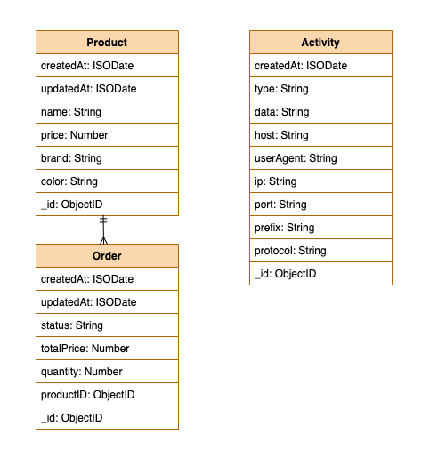

# iCommerce
An online shopping application which sell the products.

### Technologies
- [x] **Container Orchestration Engine**: [Kubernetes](https://kubernetes.io/) - [Docker](https://www.docker.com/)
- [x] **The package manager for Kubernetes**: [Helm](https://helm.sh/)
- [x] **Service mesh for Kubernetes**: [Linkerd](https://linkerd.io/)
- [x] **Reverse proxy and load balancer**: [Traefik](https://containo.us/traefik/)
- [x] **Monitoring & Metrics**: [Grafana](https://grafana.com/), [Prometheus](https://prometheus.io/)
- [x] **Logging**: [Fluentd](https://www.fluentd.org/), [Elastic Search](https://www.elastic.co/home), [Kibana](https://www.elastic.co/kibana)
- [x] **Message System**: [NATS](https://nats.io/)
- [x] **Caching System**: [Redis](https://redis.io/)
- [x] **Cert Management**: [Cert-manager](https://cert-manager.io/docs/)
- [x] **Database**: [MongoDB](https://www.mongodb.com/)
- [x] **Backend**: [NodeJS](https://nodejs.org/en/)

### High level Architecture


**You should take a look all services at**:
- `/build/base/scripts/install-deps.sh`
- `/build/base/scripts/install-services.sh`

### Sequence Diagram ( UML )


### Database Design

- **Product**: store all products and products' information.
- **Order**: store all orders' information when user places an order.
- **Activity**:  store all searchs' information when user search, filter, detail the product.


**What?**
- Use a (single) database that is shared by multiple services. 
- **Schema-per-service** – each service has a database schema that’s private to that service

**Why?**
- This is a good start to break the application into smaller logical pieces. 
- **This should not be applied for greenfield applications**. 
- In this pattern, one database can be aligned with more than one microservice, but it has to be restricted to 2-3 maximum.

**Next steps?**
- We should apply **Database-server-per-service** – each service has its own database server by using Helm to create many database.
- Therefore, it can be scaled, independence, and autonomy


###Logging System


**What?**
- **Micro-service**: NodeJS rest application. Logs will be sent to fluentd.
- **Fluentd**: Unify all facets of processing log data: collecting, filtering, buffering, and outputting logs across multiple sources and destinations. In our case, it will receive logs from the microservice format and forward/post them to elasticsearch.
- **Elastic-search**: Search engine and a full-text, distributed NoSQL database.
- **Kibana**: Front-end for elastic-search.

**Why?**
Centralized logging is key to a shorter mean time to resolution (MTTR) and speedy Root Cause Analysis (RCA). Whilst logging and monitoring are usually considered to be separate topics in their own right, log event-based alerts provide a good combination.

**Next steps?**
- Transferring **Activity's service** to Elastic Search then Marketing ( for instance ) can search, virtualize and analytic them.


### Service mesh & Monitoring


**What?**
- **Linkerd** is a service mesh for Kubernetes. It makes running services easier and safer by giving you runtime debugging, observability, reliability, and security—all without requiring any changes to your code.

**Why?**
- When you write a microservice the  actual logic can be very minimal. The code for the service itself could be extremely simple, but when you add all the important security, observability and reliability aspects the code can balloon. All those critical aspects have nothing to do with the functionality of the service itself. They are all orthogonal operational concerns. 

- The service mesh allows the same benefits, but actually makes it easier because it can be bolted on completely transparently without changes to the application.

- If you build and manage a large-scale cloud-native application you want, you should apply service mesh 😉

**Next steps?**
- Linkerd's traffic split functionality allows you to dynamically shift arbitrary portions of traffic destined for a Kubernetes service to a different destination service. This feature can be used to implement sophisticated rollout strategies such as **canary deployments** and **blue/green deployments**
- **Fault injection** is a form of chaos engineering where the error rate of a service is artificially increased to see what impact there is on the system as a whole.
- For production workloads, Linkerd's control plane can run in high availability (HA) mode.


### Code folder structure
```
├── build
│   ├── base                     // base configurations
│   │   ├── charts               // Helm charts template
│   │   │   ├── activity         // Helm chart for Activity service
│   │   │   ├── cert-manager     // Helm chart for Cert Manager service
│   │   │   ├── elasticsearch    // Helm chart for Elasticsearch service
│   │   │   ├── fluentd          // Helm chart for Fluentd service
│   │   │   ├── linkerd          // Helm chart for Linkerd service
│   │   │   ├── mongodb          // Helm chart for MongoDB service
│   │   │   ├── nats             // Helm chart for Nats service
│   │   │   ├── order            // Helm chart for Order service
│   │   │   ├── product          // Helm chart for Product service
│   │   │   ├── redis            // Helm chart for Redis service
│   │   │   └── traefik          // Helm chart for Traefik service
│   │   └── scripts
│   ├── dev
│   │   ├── charts               // overwrite values to base charts with dev environment
│   │   │   ├── activity
│   │   │   ├── ...
│   │   │   ├── product
│   │   │   ├── traefik
│   │   ├── configs             // configurations for dev environment
│   │   └── scripts             // scripts for dev environment
│   └── production              
│       ├── charts              // overwrite values to base charts with production environment
│       │   ├── activity
│       │   ├── ...
│       │   ├── product
│       │   ├── traefik
│       ├── configs             // configurations for production environment
│       └── scripts             // scripts for production environment
├── diagrams
└── services
    ├── activity                // Activity service code
    │   ├── build
    │   └── src
    │       ├── __test__
    │       ├── controllers
    │       ├── events
    │       │   └── subscription
    │       ├── helpers
    │       ├── middlewares
    │       └── models
    ├── order                   // Order service code
    │   ├── build
    │   └── src
    │       ├── __test__
    │       ├── controllers
    │       ├── events
    │       │   └── publisher
    │       ├── helpers
    │       ├── middlewares
    │       └── models
    └── product                 // Product service code
        ├── build
        └── src
            ├── __test__
            ├── controllers
            ├── events
            │   └── publisher
            ├── helpers
            ├── middlewares
            └── models
```

### Build and Deploy

**Prerequisites**
1. [Install Docker](https://www.docker.com/get-started)
2. [Install Helm v3](https://helm.sh/docs/intro/install/)

**Run the application**
- Dev mode: `./build/dev/scripts/start.sh`
- Production mode: `./build/production/scripts/start.sh`

**NOTICE**: **You should modify some values in `custom-values.yaml` corresponding to particular services and specific environment**

**For Dev Mode**
Please copy some visual hosts to `/etc/hosts`
```
127.0.0.1   api.i-commerce.example
127.0.0.1   kibana.i-commerce.example
127.0.0.1   traefik.i-commerce.example
127.0.0.1   linkerd.i-commerce.example
```
**Access/API links for DEV Mode**:
- Product API: http://api.i-commerce.example/products
- Activity API: http://api.i-commerce.example/activities
- Order API: http://api.i-commerce.example/orders
- Kibana: http://kibana.i-commerce.example
- Traefik Dashboard: http://traefik.i-commerce.example
- Linkerd Dashboard: http://linkerd.i-commerce.example

==========================================

**👉 IMPORTANT: You can use [POSTMAN](https://www.postman.com/downloads/) to call your API**

### APIs
**Product API**
- Create Product
```shell
curl -X POST \
 'http://api.i-commerce.example/products' \
  -H 'Cache-Control: no-cache' \
  -H 'Content-Type: application/json' \
  -d '{
    "name": "ÁO POLO NAM",
    "price": 50000,
    "brand": "OOOP",
    "color": "red"
}'
```
- Get Product by ID

```shell
curl -X GET \
  'http://api.i-commerce.example/products/${productID}' \
  -H 'Cache-Control: no-cache'
```

- Search Products with filters
```shell
curl -X GET \
  'http://api.i-commerce.example/products?limit=10&page=0&brand=OOOP&color=red' \
  -H 'Cache-Control: no-cache'
```

- Search Products without filters
```shell
curl -X GET \
  'http://api.i-commerce.example/products?limit=10&page=0' \
  -H 'Cache-Control: no-cache'
```

- Update Product

```shell
curl -X PUT \
  'http://api.i-commerce.example/products/${productID}' \
  -H 'Cache-Control: no-cache' \
  -H 'Content-Type: application/json' \
  -d '{
	"name": "ÁO POLO NAM 2020"
}'
```

- Delete Product

```shell
curl -X DELETE \
  'http://api.i-commerce.example/products/${productID}' \
  -H 'Cache-Control: no-cache'
```

**Order API**
- Create Order
```shell
curl -X POST \
  'http://api.i-commerce.example/orders' \
  -H 'Cache-Control: no-cache' \
  -H 'Content-Type: application/json' \
  -d '{
    "productId": "${productID}",
    "quantity": 5
}'
```
- Get Order by ID

```shell
curl -X GET \
  'http://api.i-commerce.example/orders/${orderID}' \
  -H 'Cache-Control: no-cache'
```

- Search Orders
```shell
curl -X GET \
  'http://api.i-commerce.example/orders?limit=10&page=0' \
  -H 'Cache-Control: no-cache'
```

- Update Order

```shell
curl -X PUT \
  'http://api.i-commerce.example/orders/${orderID}' \
  -H 'Cache-Control: no-cache' \
  -H 'Content-Type: application/json' \
  -d '{
	"status": "COMPLETED"
}'
```

- Delete Order

```shell
curl -X DELETE \
  'http://api.i-commerce.example/orders/${orderID}' \
  -H 'Cache-Control: no-cache'
```

**Activity API**
- Get Activity by ID

```shell
curl -X GET \
  'http://api.i-commerce.example/activities/${activityID}' \
  -H 'Cache-Control: no-cache'
```

- Search Activities
```shell
curl -X GET \
  'http://api.i-commerce.example/activities?limit=10&page=0' \
  -H 'Cache-Control: no-cache'
```

### To do list due to time constraint
- [ ] Vault: Key Management
- [ ] Cert-manager
- [ ] Redis Caching
- [ ] GitOps - CI/CD
- [ ] SonarQube in CI/CD
- [ ] Storage Operators
- [ ] High Availability